i# React Native JSONForms Formatter - Component Diagram

```mermaid
graph TD
    %% External consumers
    RN[React Native App]
    
    %% Main library interface
    LIB[📦 @earthranger/react-native-jsonforms-formatter]
    
    %% V1 API (Original)
    V1_API[🔷 V1 API]
    VALIDATE[🔍 validateJSONSchema]
    GENERATE_V1[🎨 generateUISchema V1]
    
    %% V2 API (New Schema Format)
    V2_API[🔶 V2 API]
    GENERATE_V2[🎨 generateUISchema V2]
    
    %% V1 Processing modules
    JSON_PROC[📝 JSON Processing]
    SCHEMA_VAL[✅ Schema Validation]
    NUMBER_NORM[🔢 Number Normalization]
    FIELD_PROC[🏗️ Field Processing]
    UI_GEN_V1[🖼️ UI Generation V1]
    
    %% V2 Processing modules
    FIELD_VISIBILITY[👁️ Field Visibility Processing]
    FIELD_GROUPING[📋 Field Grouping by Section]
    SECTION_ORDER[📑 Section Order Processing]
    CONTROL_CREATION[🎛️ Field Control Creation]
    LAYOUT_CREATION[🏗️ Section Layout Creation]
    
    %% V1 Utility functions
    UTILS_V1[🛠️ V1 Utils]
    TRAVERSE[traverseSchema]
    NORMALIZE[normalizeDecimalSeparators]
    DUPLICATE[hasDuplicatedItems]
    REQUIRED[isRequiredProperty]
    CHECKBOX[isCheckbox]
    FIELDSET[isFieldSet]
    
    %% V2 Utility functions  
    UTILS_V2[🛠️ V2 Utils]
    IS_VISIBLE[isFieldVisible]
    GET_VISIBLE[getVisibleFields]
    GROUP_FIELDS[groupFieldsBySection]
    CREATE_CONTROL[createControl]
    CREATE_HEADER[createHeaderLabel]
    CREATE_SECTION[createSectionLayout]
    COLLECTION_INTERNAL[generateCollectionUISchemaInternal]
    
    %% Shared Schema Utilities
    SCHEMA_UTILS[🔧 Schema Utils]
    DETECT_VERSION[detectSchemaVersion]
    PROCESS_SCHEMA[processSchema]
    
    %% Data flow
    RN --> LIB
    
    LIB --> V1_API
    LIB --> V2_API
    LIB --> SCHEMA_UTILS
    
    %% V1 Flow
    V1_API --> VALIDATE
    V1_API --> GENERATE_V1
    
    VALIDATE --> JSON_PROC
    VALIDATE --> SCHEMA_VAL
    VALIDATE --> NUMBER_NORM
    VALIDATE --> FIELD_PROC
    
    GENERATE_V1 --> UI_GEN_V1
    
    JSON_PROC --> UTILS_V1
    SCHEMA_VAL --> UTILS_V1
    NUMBER_NORM --> UTILS_V1
    FIELD_PROC --> UTILS_V1
    UI_GEN_V1 --> UTILS_V1
    
    UTILS_V1 --> TRAVERSE
    UTILS_V1 --> NORMALIZE
    UTILS_V1 --> DUPLICATE
    UTILS_V1 --> REQUIRED
    UTILS_V1 --> CHECKBOX
    UTILS_V1 --> FIELDSET
    
    %% V2 Flow
    V2_API --> GENERATE_V2
    
    GENERATE_V2 --> FIELD_VISIBILITY
    GENERATE_V2 --> FIELD_GROUPING
    GENERATE_V2 --> SECTION_ORDER
    GENERATE_V2 --> CONTROL_CREATION
    GENERATE_V2 --> LAYOUT_CREATION
    
    FIELD_VISIBILITY --> UTILS_V2
    FIELD_GROUPING --> UTILS_V2
    SECTION_ORDER --> UTILS_V2
    CONTROL_CREATION --> UTILS_V2
    LAYOUT_CREATION --> UTILS_V2
    
    UTILS_V2 --> IS_VISIBLE
    UTILS_V2 --> GET_VISIBLE
    UTILS_V2 --> GROUP_FIELDS
    UTILS_V2 --> CREATE_CONTROL
    UTILS_V2 --> CREATE_HEADER
    UTILS_V2 --> CREATE_SECTION
    UTILS_V2 --> COLLECTION_INTERNAL
    
    SCHEMA_UTILS --> DETECT_VERSION
    SCHEMA_UTILS --> PROCESS_SCHEMA
    
    %% Styling
    classDef publicAPI fill:#e1f5fe,stroke:#0277bd,stroke-width:3px
    classDef v1Internal fill:#f3e5f5,stroke:#7b1fa2,stroke-width:2px
    classDef v2Internal fill:#fff3e0,stroke:#ef6c00,stroke-width:2px
    classDef v1Utility fill:#e8f5e8,stroke:#2e7d32,stroke-width:2px
    classDef v2Utility fill:#fce4ec,stroke:#c2185b,stroke-width:2px
    classDef sharedUtility fill:#f0f4c3,stroke:#827717,stroke-width:2px
    
    class LIB,V1_API,V2_API,VALIDATE,GENERATE_V1,GENERATE_V2 publicAPI
    class JSON_PROC,SCHEMA_VAL,NUMBER_NORM,FIELD_PROC,UI_GEN_V1 v1Internal
    class FIELD_VISIBILITY,FIELD_GROUPING,SECTION_ORDER,CONTROL_CREATION,LAYOUT_CREATION v2Internal
    class UTILS_V1,TRAVERSE,NORMALIZE,DUPLICATE,REQUIRED,CHECKBOX,FIELDSET v1Utility
    class UTILS_V2,IS_VISIBLE,GET_VISIBLE,GROUP_FIELDS,CREATE_CONTROL,CREATE_HEADER,CREATE_SECTION,COLLECTION_INTERNAL v2Utility
    class SCHEMA_UTILS,DETECT_VERSION,PROCESS_SCHEMA sharedUtility
```

## Component Description

### 🔵 Public API (Blue)
- **Main Library**: Entry point for consumers
- **V1 API**: Original schema format processing
  - **validateJSONSchema**: Validates and normalizes JSON schemas
  - **generateUISchema V1**: Generates UI schema from validated JSON schema
- **V2 API**: New EarthRanger schema format processing
  - **generateUISchema V2**: Generates UI schema from V2 schema format (automatically handles collections)

### 🟣 V1 Internal Processing (Purple)
- **JSON Processing**: Handles JSON parsing, cleaning, and formatting
- **Schema Validation**: Validates schema structure and detects errors
- **Number Normalization**: Converts comma decimal separators to periods
- **Field Processing**: Processes fieldsets, checkboxes, and other field types
- **UI Generation V1**: Creates UI schema elements from JSON schema

### 🟠 V2 Internal Processing (Orange)
- **Field Visibility Processing**: Filters deprecated and invisible fields using getVisibleFields
- **Field Grouping by Section**: Groups visible fields by their parent sections using groupFieldsBySection
- **Section Order Processing**: Processes sections in the order specified by the schema's ui.order array
- **Field Control Creation**: Creates JSONForms controls for each visible field with field-type-specific options
- **Section Layout Creation**: Creates single-column VerticalLayout sections with ordered elements (leftColumn first, then rightColumn)

### 🟢 V1 Utilities (Green)
- **V1 Utils Module**: Core utility functions for V1 processing
- **traverseSchema**: Recursively processes nested schema objects
- **normalizeDecimalSeparators**: Converts comma decimals (12,99 → 12.99)
- **hasDuplicatedItems**: Detects duplicate items in arrays
- **isRequiredProperty**: Checks if a property is required
- **isCheckbox**: Identifies checkbox field types
- **isFieldSet**: Identifies fieldset structures

### 🔴 V2 Utilities (Pink)
- **V2 Utils Module**: Specialized utility functions for V2 processing
- **isFieldVisible**: Checks if field should be rendered (not deprecated)
- **getVisibleFields**: Filters and returns all visible fields from schema
- **groupFieldsBySection**: Groups fields by their parent section for layout processing  
- **createControl**: Creates JSONForms control elements with field-type-specific options and collection embedding
- **createHeaderLabel**: Creates header/label elements for sections
- **createSectionLayout**: Creates single-column VerticalLayout optimized for React Native with ordered elements
- **generateCollectionUISchemaInternal**: Internal function for automatic collection item UI schema generation

### 🟡 Shared Schema Utilities (Yellow-Green)
- **Schema Utils Module**: Cross-version utility functions for schema processing
- **detectSchemaVersion**: Analyzes schema structure to determine if it's V1 or V2 format
- **processSchema**: Processes schema string and returns version-appropriate data structure

## Data Flow

### V1 Flow (Original)
1. Consumer apps import the library
2. Raw JSON schema strings are passed to validation functions
3. V1 processors clean, validate, and normalize the data
4. V1 utility functions handle specific transformations
5. Clean, validated schemas are returned to consumers

### V2 Flow (New Schema Format)
1. Consumer apps import V2 functions  
2. Structured V2 schema objects are passed to generateUISchema
3. **Field Visibility Processing**: getVisibleFields filters out deprecated fields
4. **Field Grouping**: groupFieldsBySection organizes fields by their parent sections
5. **Section Processing**: Iterate through ui.order array to process sections in specified order
6. **Control Creation**: createControl generates JSONForms controls with field-type-specific options
7. **Layout Creation**: createSectionLayout builds single-column VerticalLayout with ordered elements
8. React Native optimized UI schemas with embedded collection details are returned to consumers

## Key Differences
- **V1**: Processes raw JSON strings, requires validation and normalization
- **V2**: Processes structured schema objects, optimized for React Native single-column layouts
- **V2**: Supports advanced features like headers, sections, collections, and field visibility
- **V2**: Automatically embeds collection item UI schemas (no separate function calls needed)
- **V2**: Handles all EarthRanger custom field types (TEXT, NUMERIC, CHOICE_LIST, DATE_TIME, LOCATION, COLLECTION, ATTACHMENT)
- **V2**: Processes field constraints (maxItems/minItems, leftColumn/rightColumn layout)
- **V2**: Mobile-first design with always-vertical layouts for React Native
- **V2**: Compatible with JSONForms React Native custom renderers
